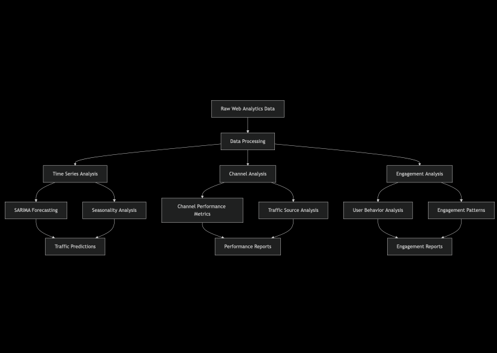

# Site Traffic Monitor

## Overview
This project analyzes website traffic and user engagement patterns using Python. It includes data processing, visualization, and time series forecasting to understand user behavior and predict future traffic patterns.

## Project Architecture

### Data Flow

   


## Features
- Time series analysis of user sessions and engagement metrics
- Channel performance analysis
- User behavior correlation studies
- Traffic forecasting using SARIMA models
- Interactive visualizations

## Requirements
```python
pandas
numpy
matplotlib
statsmodels
seaborn
```

## Data Structure
The analysis expects data with the following columns:
- Date + hour (YYYYMMDDHH)
- Users
- Sessions
- Engaged sessions
- Average engagement time per session
- Events per session
- Engagement rate
- Session primary channel group

## Key Components

### 1. Time Series Analysis
- Hourly traffic patterns
- User and session correlation
- Engagement metrics over time
- Seasonal decomposition

### 2. Channel Analysis
- Traffic sources comparison
- Channel-wise engagement rates
- Events per session by channel
- Normalized performance metrics

### 3. User Engagement Analysis
- Average engagement time
- Events per session
- Engagement rate patterns
- Session quality metrics

### 4. Forecasting
- SARIMA model implementation
- 24-hour ahead predictions
- Seasonal pattern recognition
- Accuracy metrics

## Key Findings
1. Strong 24-hour seasonality in traffic patterns
2. Organic Social drives highest volume but not highest engagement
3. Organic Video shows best engagement quality
4. Consistent correlation between engagement time and event frequency

## Usage

1. Data Preparation:
```python
# Convert datetime and numeric columns
data['Date + hour (YYYYMMDDHH)'] = pd.to_datetime(data['Date + hour (YYYYMMDDHH)'], format='%Y%m%d%H')
data['Users'] = pd.to_numeric(data['Users'])
data['Sessions'] = pd.to_numeric(data['Sessions'])
```

2. Basic Analysis:
```python
# Group data by date and calculate metrics
grouped_data = data.groupby(data['Date + hour (YYYYMMDDHH)']).agg({
    'Users': 'sum',
    'Sessions': 'sum'
})
```

3. Run Forecasting:
```python
# Initialize and fit SARIMA model
sarima_model = SARIMAX(time_series_data,
    order=(1, 1, 1),
    seasonal_order=(1, 1, 1, 24))
sarima_model_fit = sarima_model.fit()
```

## Future Improvements
1. Add real-time data processing capabilities
2. Implement more advanced forecasting models
3. Create interactive dashboard
4. Add anomaly detection
5. Develop automated reporting system

## Contributing
Contributions are welcome! Please feel free to submit a Pull Request.

## License
This project is licensed under the MIT License - see the LICENSE file for details.
